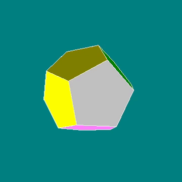
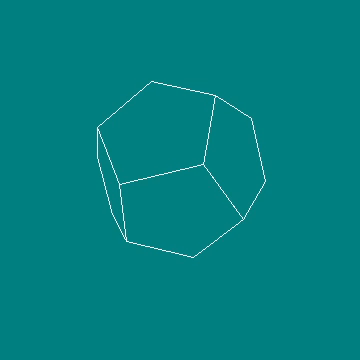

# Spin

## Description

Spin - a simple application for drawing three-dimensional shapes using an old library graphics.h.

## Requirements

To compile and run, you need a dev-cpp development environment (optional but simpler) and a 32 bit compiler. In addition, you need to add graphics.h, winbgim.h and libbgi.a files to the compiler header files. All installation information can be found at:

[How to add graphics in dev C++](https://gamespec.tech/how-to-add-graphics-in-dev-c/)

